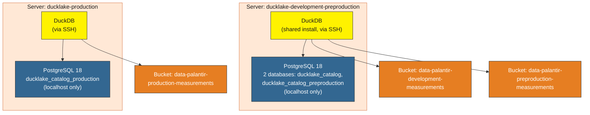

# DuckLake on Hetzner

[](https://github.com/berndsen-io/ducklake-hetzner/actions/workflows/test.yml)
[](https://github.com/berndsen-io/ducklake-hetzner/actions/workflows/e2e.yml)
[](https://docs.astral.sh/ruff/)

[](https://www.python.org/)
[](https://opentofu.org/)
[](https://duckdb.org/)
[](https://ducklake.select/)
[](LICENSE)
[](https://github.com/berndsen-io/ducklake-hetzner/stargazers)
[](https://github.com/berndsen-io/ducklake-hetzner/commits/main)

Deploy a [DuckLake](https://ducklake.select/) data lakehouse on Hetzner for under €15/month.

**What you get:** PostgreSQL for metadata, Hetzner Object Storage (S3) for data, DuckDB as the query engine. All managed with OpenTofu and PyInfra. Read the [full write-up](https://berndsen.io/blog/0402-ducklake-hetzner/) for background and design decisions.

## Architecture

Three environments run across two servers:



`development` and `preproduction` share one server but are isolated from
each other via separate Postgres roles/databases (neither role can
authenticate into the other's database) and separate S3 buckets.
`production` runs on its own dedicated server entirely.

## Prerequisites

- [OpenTofu](https://opentofu.org/) (Terraform fork)
- [uv](https://docs.astral.sh/uv/) (Python package manager)
- `ssh` and `scp` (for connecting to the server and running DuckDB there)
- A [Hetzner Cloud](https://www.hetzner.com/cloud/) account with:
  - An API token (Cloud Console → Security → API Tokens)
  - Object Storage access keys (Cloud Console → Object Storage → Manage keys)
  - Each team member's SSH public key already added under **Security → SSH keys**
    in the console, under the name their key is registered as (see
    `team_ssh_key_names` in `terraform/environments/*.tfvars`). Terraform looks
    these up by name rather than creating new key resources, so a key must
    already exist in the console before a server can be built with it.

## Structure

```
terraform/
  hetzner.tf, minio.tf, output.tf, providers.tf  # infra definitions (parameterized)
  environments/
    development-preproduction.tfvars             # shared dev+preprod server
    production.tfvars                             # dedicated production server
config/        # PyInfra server provisioning (PostgreSQL, DuckDB, firewall)
env-templates/ # .env templates -- see Setup below
init.sql       # DuckDB initialization script (environment-agnostic; reads
               # POSTGRES_DATABASE / POSTGRES_USER from env)
Makefile       # Deployment automation
```

## Setup

There are two servers to deploy, and (up to) three environments to connect
to. Deploying a server and connecting as a client use **different** `.env`
files — see `env-templates/` for all five templates.

### 1. Deploy a server

Pick the server you're deploying and copy its template:

```bash
# Shared server (development + preproduction):
cp env-templates/.env.deploy-development-preproduction.sample .env.deploy-development-preproduction
# ...fill in TF_VAR_hcloud_token, S3_ACCESS_KEY/SECRET_KEY, and one
#    POSTGRES_DB_PASSWORD_<ENVIRONMENT> per environment it hosts.

# OR the dedicated production server:
cp env-templates/.env.deploy-production.sample .env.deploy-production
```

Load it and deploy:

```bash
set -a && source .env.deploy-development-preproduction && set +a   # (or .env.deploy-production)
make init
make terraform-apply   # provisions the server + its S3 bucket(s)
make deploy            # installs PostgreSQL + DuckDB, configures the firewall
```

`terraform-apply` prints the new server's IP and writes it to
`data/<TF_WORKSPACE>_server_ip.json`. Copy that IP into `SSH_HOST` in the
relevant client-side `.env.<environment>` file(s) from Step 2 — for the
shared server, that means **both** `.env.development` and
`.env.preproduction` get the same `SSH_HOST`.

Repeat this step for the other server when you're ready (each has its own
`.tfvars` file and OpenTofu workspace, so applying one never touches the
other's state).

### 2. Connect to an environment

Copy the template for whichever environment you want:

```bash
cp env-templates/.env.development.sample .env.development
# ...fill in SSH_HOST (from Step 1), POSTGRES_DB_PASSWORD (matching what
#    was set at deploy time), and S3_ACCESS_KEY/SECRET_KEY.
```

Load it and connect:

```bash
set -a && source .env.development && set +a   # or .env.preproduction / .env.production
make duckdb
```

DuckDB runs **on the server**, not on your machine — Postgres only accepts
loopback connections (see Security below), so the query engine has to live
next to the catalog. `make duckdb` copies `init.sql` over and opens an
interactive DuckDB session over SSH, connected to that environment's own
database and bucket.

You're now connected to your DuckLake. Try it:

```sql
CREATE TABLE flights AS
    SELECT * FROM 'https://duckdb.org/data/flights.csv';

SELECT * FROM flights LIMIT 10;
```

## Security

PostgreSQL is locked down to loopback connections only
(`listen_addresses = 'localhost'`, `pg_hba.conf` restricted to `127.0.0.1/32`).
It is not reachable from outside the server at all — not by IP allowlist,
not by any firewall rule. This is why DuckDB runs on the server itself
(over SSH) rather than connecting in from a client machine.

The server firewall (iptables) only allows SSH (port 22); PostgreSQL's port
is not opened externally, since nothing outside the server is meant to
reach it. fail2ban is installed for SSH brute-force protection.

**Environment isolation on the shared server:** `development` and
`preproduction` share one Postgres instance but use separate roles and
databases, each restricted (in `pg_hba.conf`) to loopback access on its
own database only. A valid `development` password cannot authenticate
into the `preproduction` database, or vice versa. They also write to
separate S3 buckets.

## Cost

This setup now runs **two servers** (`cpx22`, 2 vCPU / 4 GB RAM / 80 GB NVMe
each) — one shared by development + preproduction, one dedicated to
production — plus three S3 buckets.

> **Note on pricing accuracy:** Hetzner adjusted Cloud pricing in 2026
> (including a further change effective 15 June 2026), so published
> figures from before then are stale. Rather than restate a number here
> that may already be wrong by the time you read this, check current
> pricing directly at [hetzner.com/cloud](https://www.hetzner.com/cloud/)
> and [Object Storage pricing](https://www.hetzner.com/storage/object-storage/)
> before budgeting. As of mid-2026, `cpx22` runs roughly €7-8/month per
> server (excl. VAT) — so budget for roughly double a single-server setup,
> plus Object Storage's base + usage-based cost across three buckets.

To reduce cost, `server_type` in each `terraform/environments/*.tfvars`
file can be lowered (e.g. to `cx23`), independently per server — for
instance, running preproduction/development on a smaller type than
production.

### Comparison

> Figures below are from the linked blog post and predate Hetzner's 2026
> price adjustments — treat as directionally useful, not current.

| Provider | Instance | Specs | Monthly cost |
|---|---|---|---|
| **Hetzner** | CX33 | 4 vCPU, 8 GB RAM | ~€13/mo (VPS + S3) |
| DigitalOcean | Droplet | 4 vCPU, 8 GB RAM | ~$48/mo |
| Scaleway | DEV1-L | 4 vCPU, 8 GB RAM | ~€31/mo |
| AWS | t3.large | 2 vCPU, 8 GB RAM | ~$60/mo (before RDS + S3) |

See the [blog post](https://berndsen.io/blog/0402-ducklake-hetzner/) for a full breakdown (note: written for the original single-server setup, not the current multi-environment architecture).

## Testing

Run all checks locally:

```bash
make test
```

This runs `make lint` (tofu fmt, ruff check, ruff format) and `make validate` (tofu validate).

## Contributing

### Local setup

Set up git hooks to run linting before each commit:

```bash
git config core.hooksPath .githooks
```

### CI

Every pull request triggers two workflows:

- **Test** — ruff lint/format checks and OpenTofu format/validate. Runs automatically.
- **E2E** — full stack validation (Hetzner server + S3 + PyInfra deploy + DuckDB connectivity). Requires a maintainer to [approve the deployment](https://docs.github.com/en/actions/managing-workflow-runs-and-deployments/managing-deployments/managing-environments-for-deployment) before it runs, to prevent unnecessary Hetzner costs.

The E2E workflow can also be triggered manually via `workflow_dispatch` from the Actions tab.

## Resources

- [DuckLake documentation](https://ducklake.select/)
- [DuckDB PostgreSQL Catalog](https://duckdb.org/docs/extensions/postgres.html)
- [DuckDB S3 Configuration](https://duckdb.org/docs/extensions/httpfs/s3api.html)
- [Hetzner Terraform Provider](https://registry.terraform.io/providers/hetznercloud/hcloud/latest/docs)
- [ducklake-guard](https://github.com/berndsen-io/ducklake-guard) — access control for DuckLake lakehouses

---

## Need help deploying DuckLake for your team?

We help teams set up and optimize DuckLake deployments. Visit [berndsen.io](https://berndsen.io) to learn more.
