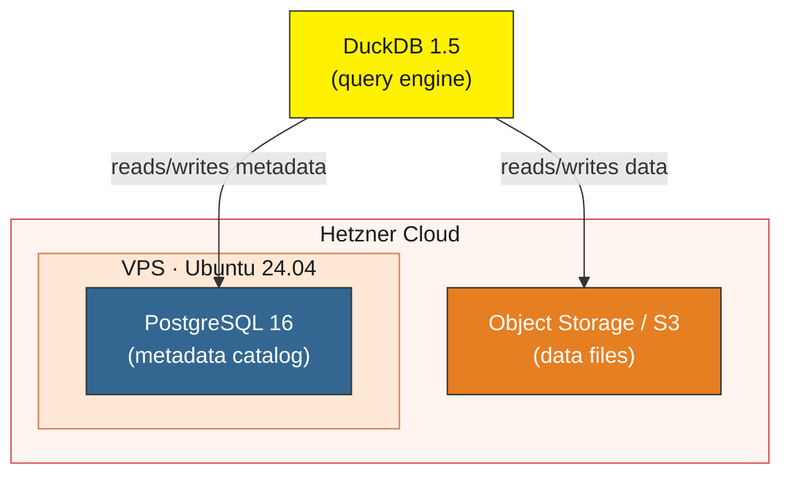

# DuckLake on Hetzner

[](https://github.com/berndsen-io/ducklake-hetzner/actions/workflows/test.yml)
[](https://github.com/berndsen-io/ducklake-hetzner/actions/workflows/e2e.yml)
[](https://docs.astral.sh/ruff/)

[](https://www.python.org/)
[](https://opentofu.org/)
[](https://duckdb.org/)
[](https://ducklake.select/)
[](LICENSE)
[](https://github.com/berndsen-io/ducklake-hetzner/stargazers)
[](https://github.com/berndsen-io/ducklake-hetzner/commits/main)

Deploy a [DuckLake](https://ducklake.select/) data lakehouse on Hetzner for under €15/month.

**What you get:** PostgreSQL for metadata, Hetzner Object Storage (S3) for data, DuckDB as the query engine. All managed with OpenTofu and PyInfra. Read the [full write-up](https://berndsen.io/blog/0402-ducklake-hetzner/) for background and design decisions.

## Architecture



## Prerequisites

- [OpenTofu](https://opentofu.org/) (Terraform fork)
- [uv](https://docs.astral.sh/uv/) (Python package manager)
- [DuckDB](https://duckdb.org/) v1.5.0+
- A [Hetzner Cloud](https://www.hetzner.com/cloud/) account with:
  - An API token (Cloud Console → Security → API Tokens)
  - Object Storage access keys (Cloud Console → Object Storage → Manage keys)

## Structure

```
terraform/   # OpenTofu infrastructure (server + S3 bucket)
config/      # PyInfra server provisioning (PostgreSQL, firewall)
init.sql     # DuckDB initialization script
Makefile     # Deployment automation
```

## Setup

### 1. Configure environment

```bash
cp .env.sample .env
```

Fill in your Hetzner API token, storage keys, and a PostgreSQL password. Then source it:

```bash
set -a && source .env && set +a
```

### 2. Generate SSH keys (if needed)

```bash
ssh-keygen -t ed25519 -f ~/.ssh/id_rsa
```

Update `TF_VAR_ssh_public_key_path` and `SSH_KEY_PATH` in `.env` if using a different path.

### 3. Deploy

```bash
make init    # initialize OpenTofu
make all     # provision infrastructure + configure server
```

This creates a Hetzner VPS with PostgreSQL and an S3 bucket. After `make all` completes, set `POSTGRES_HOST` in your `.env` to the server IP printed in the Terraform output.

### 4. Connect with DuckDB

```bash
set -a && source .env && set +a
make duckdb # this runs duckdb -init init.sql, loading all relevant information
```

You're now connected to your DuckLake. Try it:

```sql
CREATE TABLE flights AS
    SELECT * FROM 'https://duckdb.org/data/flights.csv';

SELECT * FROM flights LIMIT 10;
```

## Security

This setup configures PostgreSQL to accept connections from all IP addresses (`0.0.0.0/0`). This is intentionally simple for getting started. For production use, restrict access in `config/tasks/postgres.py` by changing the `pg_hba.conf` line to your specific IP:

```python
line="host    ducklake_catalog           ducklake         YOUR_IP/32          md5",
```

The server firewall (iptables) only allows SSH (port 22) and PostgreSQL (port 5432). fail2ban is installed for SSH brute-force protection.

## Cost

- **VPS (cx33):** ~€6.49/month — 4 vCPU, 8GB RAM, 80GB NVMe SSD
- **Object Storage:** ~€6.49/month base
- **Static IPv4:** included with VPS

Under €15/month for a complete DuckLake setup.

> **Note:** The cheapest option is cx23 (~€3.99/month, 2 vCPU, 4GB RAM), but Hetzner frequently lacks capacity for this tier. The default cx33 is used for reliable provisioning. To try cx23, change `server_type` in `terraform/hetzner.tf`.

### Comparison

| Provider | Instance | Specs | Monthly cost |
|---|---|---|---|
| **Hetzner** | CX33 | 4 vCPU, 8 GB RAM | ~€13/mo (VPS + S3) |
| DigitalOcean | Droplet | 4 vCPU, 8 GB RAM | ~$48/mo |
| Scaleway | DEV1-L | 4 vCPU, 8 GB RAM | ~€31/mo |
| AWS | t3.large | 2 vCPU, 8 GB RAM | ~$60/mo (before RDS + S3) |

See the [blog post](https://berndsen.io/blog/0402-ducklake-hetzner/) for a full breakdown.

## Testing

Run all checks locally:

```bash
make test
```

This runs `make lint` (tofu fmt, ruff check, ruff format) and `make validate` (tofu validate).

## Contributing

### Local setup

Set up git hooks to run linting before each commit:

```bash
git config core.hooksPath .githooks
```

### CI

Every pull request triggers two workflows:

- **Test** — ruff lint/format checks and OpenTofu format/validate. Runs automatically.
- **E2E** — full stack validation (Hetzner server + S3 + PyInfra deploy + DuckDB connectivity). Requires a maintainer to [approve the deployment](https://docs.github.com/en/actions/managing-workflow-runs-and-deployments/managing-deployments/managing-environments-for-deployment) before it runs, to prevent unnecessary Hetzner costs.

The E2E workflow can also be triggered manually via `workflow_dispatch` from the Actions tab.

## Resources

- [DuckLake documentation](https://ducklake.select/)
- [DuckDB PostgreSQL Catalog](https://duckdb.org/docs/extensions/postgres.html)
- [DuckDB S3 Configuration](https://duckdb.org/docs/extensions/httpfs/s3api.html)
- [Hetzner Terraform Provider](https://registry.terraform.io/providers/hetznercloud/hcloud/latest/docs)
- [ducklake-guard](https://github.com/berndsen-io/ducklake-guard) — access control for DuckLake lakehouses

---

## Need help deploying DuckLake for your team?

We help teams set up and optimize DuckLake deployments. Visit [berndsen.io](https://berndsen.io) to learn more.
